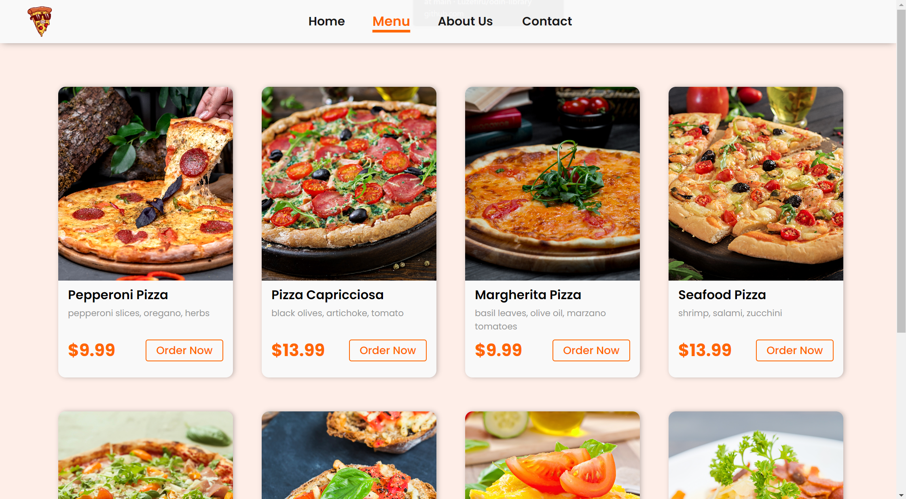
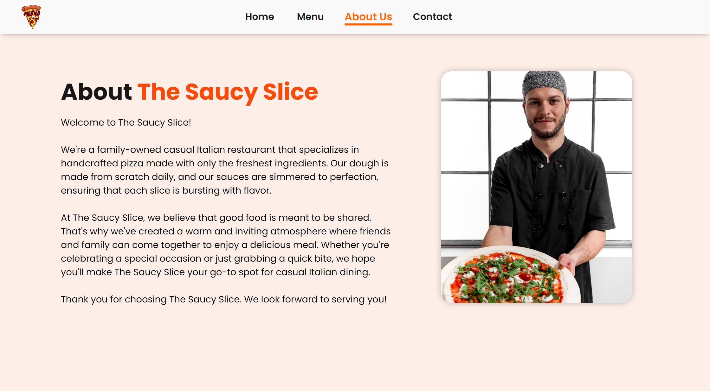
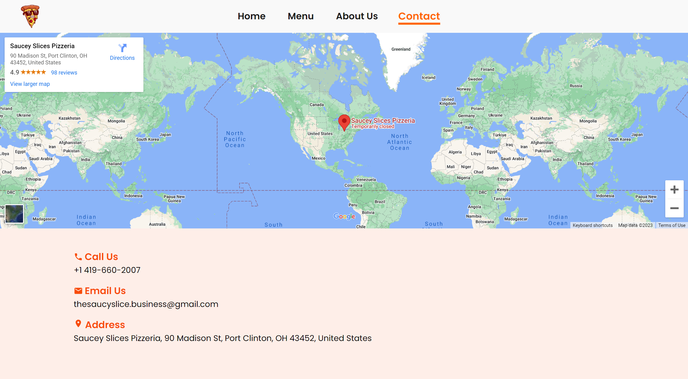

# odin-restaurant-page
A restaurant page to practice dynamic DOM Manipulation to generate the HTML code for webpage contents.

This project allowed me to create a static navbar header while a `div#contents` was used as a canvas to load the other pages via JavaScript DOM Manipulation.

webpack came in quite handy for compartmentalizing the pages into their own JavaScript `.js` files in the `/src` directory. The end product was a `main.js` file, which was linked as a script in the final `index.html` page.

I had fun creating a full screen hero section video background. It breathed a lot more life into my website.

```CSS
.hero__video {
  z-index: -1;
  width: 100%;
  min-height: 100%;
}
```

My card component design improved to become more cleaner and interactive with a `box-shadow` increase on `:hover`. I also found a way to make `border-radius` affect `background-image` `div`s inside a `div.card` with `overflow: hidden`.

```CSS
.menu__card {
  width: 18rem;
  height: 30rem;
  border-radius: 12px;
  overflow: hidden; /* REMEMBER: this makes the image also get border-radius */
  background-color: var(--surface);
  box-shadow: 2px 0 8px rgba(0, 0, 0, .25);
  transition: all 0.1s ease-in;
}

.menu__card:hover {
  box-shadow: 2px 0 16px rgba(0, 0, 0, .25);
  transform: scale(1.05);
  transition: all 0.1s ease-out;
}
```

I need to improve on:
- using more DOM manipulation to programmatically generate the cards
- modularize and refactor `index.js` files after finalizing the logic
- using webpack to bundle my `/res` images

# Output
### [Visit the Website Here](https://luzefiru.github.io/odin-restaurant-page/)





# Requirements
These were the requirements in The Odin Project's [Project: Restaurant Page](https://www.theodinproject.com/lessons/node-path-javascript-restaurant-page) site to serve as project specifications. Website aesthetic choices and implementation solely depended on me, the programmer.